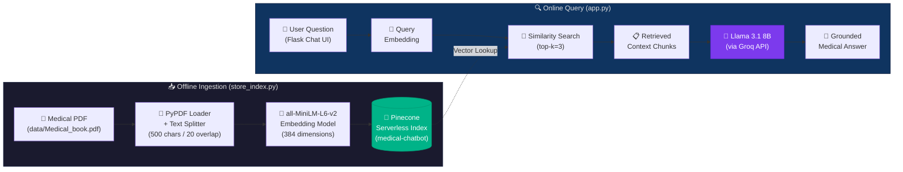

<p align="center">
  
</p>

<h1 align="center">🩺 Medical Chatbot — End-to-End RAG Pipeline</h1>

<p align="center">
  <strong>An intelligent medical Q&A assistant powered by Retrieval-Augmented Generation (RAG)</strong>
</p>

<p align="center">
  <a href="#-quick-start"></a>
  <a href="#-tech-stack"></a>
  <a href="#-tech-stack"></a>
  <a href="#-tech-stack"></a>
  <a href="#-docker--aws-deployment"></a>
  <a href="LICENSE"></a>
</p>

---

## 📖 Project Overview

This project implements a **production-ready, end-to-end Medical Chatbot** using a **Retrieval-Augmented Generation (RAG)** architecture. Instead of relying solely on an LLM's parametric knowledge, the system retrieves relevant passages from a curated medical textbook (PDF) and grounds the LLM's responses in verified medical literature — significantly reducing hallucinations and improving factual accuracy.

### How It Works

1. **Ingest** — A medical PDF textbook is parsed, chunked, and embedded into dense vectors.
2. **Store** — Embeddings are upserted into a **Pinecone** serverless vector index for sub-millisecond similarity search.
3. **Retrieve** — At query time, the user's question is embedded and the top-*k* most relevant chunks are retrieved from Pinecone.
4. **Generate** — Retrieved context and the user's question are passed to **Meta Llama 3.1 8B** (via Groq) through a LangChain RAG chain, which produces a concise, grounded answer.
5. **Serve** — The entire pipeline is exposed through a **Flask** web application with a real-time chat interface.

---

## 🛠 Tech Stack

| Category | Technology | Purpose |
|---|---|---|
| **LLM Framework** | [LangChain](https://www.langchain.com/) `v0.3.26` | Orchestrates the RAG chain — retrieval, prompt templating, and LLM invocation |
| **Large Language Model** | [Meta Llama 3.1 8B Instant](https://groq.com/) (via Groq) | Generates concise, context-grounded medical answers |
| **Vector Database** | [Pinecone](https://www.pinecone.io/) Serverless | Stores and retrieves document embeddings with cosine similarity |
| **Embeddings** | [`all-MiniLM-L6-v2`](https://huggingface.co/sentence-transformers/all-MiniLM-L6-v2) (384-dim) | Converts text chunks into dense vector representations |
| **Web Framework** | [Flask](https://flask.palletsprojects.com/) `v3.1.1` | Serves the chat UI and handles API requests |
| **Frontend** | Bootstrap 4 + jQuery + Font Awesome | Responsive, real-time chat interface |
| **PDF Processing** | [PyPDF](https://pypi.org/project/pypdf/) via LangChain `DirectoryLoader` | Extracts text from medical PDF documents |
| **Deployment** | AWS EC2 + ECR + Docker | Containerized production deployment |
| **CI/CD** | GitHub Actions | Automated build → push to ECR → deploy to EC2 |

---

## 🏗 System Architecture

The following diagram illustrates the complete RAG pipeline — from PDF ingestion through to the user-facing chat interface:



---

## 📋 Prerequisites & Environment Setup

### 1. System Requirements

- **Python** 3.10+
- **Conda** (recommended) or `venv`
- **Git**

### 2. Clone the Repository

```bash
git clone https://github.com/Kivindu02/Medical-Chatbot-with-LLMs-LangChain-Pinecone-Flask-AWS.git
cd Medical-Chatbot-with-LLMs-LangChain-Pinecone-Flask-AWS
```

### 3. Create & Activate a Conda Environment

```bash
conda create -n medical-chatbot python=3.10 -y
conda activate medical-chatbot
```

### 4. Install Dependencies

```bash
pip install -r requirements.txt
```

> **Note:** The `requirements.txt` includes `-e .` which installs the project as an editable package (defined in `setup.py`), making the `src` module importable.

### 5. Configure Environment Variables

Create a `.env` file in the project root with the following keys:

```env
PINECONE_API_KEY="your_pinecone_api_key_here"
GROQ_API_KEY="your_groq_api_key_here"
```

| Variable | Where to Get It |
|---|---|
| `PINECONE_API_KEY` | [Pinecone Console](https://app.pinecone.io/) → API Keys |
| `GROQ_API_KEY` | [Groq Console](https://console.groq.com/) → API Keys |

> [!CAUTION]
> **Never commit your `.env` file to version control.** The `.gitignore` already excludes it. Rotate any keys that have been accidentally exposed.

---

## 🚀 Execution Steps

### Step 1 — Ingest Embeddings into Pinecone

Run the ingestion script to parse the medical PDF, generate embeddings, and upsert them into Pinecone:

```bash
python store_index.py
```

**What this does:**
1. Loads all PDFs from the `data/` directory using `PyPDFLoader`
2. Filters document metadata to keep only the source field
3. Splits documents into chunks of **500 characters** with **20-character overlap**
4. Embeds each chunk using the `all-MiniLM-L6-v2` model (384 dimensions)
5. Creates a Pinecone serverless index named `medical-chatbot` (if it doesn't exist) on AWS `us-east-1`
6. Upserts all embedded chunks into the index

> [!IMPORTANT]
> You only need to run this step **once** (or whenever you update the source PDF). The vectors persist in Pinecone.

### Step 2 — Launch the Flask Application

```bash
python app.py
```

The server starts at **`http://0.0.0.0:8080`**. Open your browser and navigate to:

```
http://localhost:8080
```

You'll see the Medical Chatbot interface — type a medical question and receive a concise, RAG-grounded answer.

---

## 🐳 Docker & AWS Deployment

### Docker — Local Containerization

Build and run the application locally with Docker:

```bash
# Build the image
docker build -t medical-chatbot .

# Run the container
docker run -d \
  -e PINECONE_API_KEY="your_key" \
  -e GROQ_API_KEY="your_key" \
  -p 8080:8080 \
  medical-chatbot
```

The `Dockerfile` uses `python:3.10-slim-buster` as the base image, copies the project into `/app`, installs dependencies, and runs `app.py` as the entrypoint.

### AWS Deployment — ECR + EC2 via GitHub Actions

The project includes a fully automated CI/CD pipeline (`.github/workflows/cicd.yaml`) that triggers on every push to `main`:

```
Push to main → Build Docker Image → Push to ECR → Deploy on EC2
```

#### Pipeline Overview

| Stage | Runner | Actions |
|---|---|---|
| **Continuous Integration** | `ubuntu-latest` | Checkout → Configure AWS creds → Login to ECR → Build & push Docker image |
| **Continuous Deployment** | `self-hosted` (EC2) | Checkout → Configure AWS creds → Login to ECR → Pull & run container on port `8080` |

#### Required GitHub Secrets

Configure these in your repository's **Settings → Secrets and Variables → Actions**:

| Secret | Description |
|---|---|
| `AWS_ACCESS_KEY_ID` | IAM user access key with ECR & EC2 permissions |
| `AWS_SECRET_ACCESS_KEY` | Corresponding IAM secret key |
| `AWS_DEFAULT_REGION` | AWS region (e.g., `us-east-1`) |
| `ECR_REPO` | ECR repository name |
| `PINECONE_API_KEY` | Pinecone API key (injected at runtime) |
| `OPENAI_API_KEY` | LLM API key (injected at runtime) |

#### EC2 Setup Checklist

1. Launch an EC2 instance (Ubuntu recommended)
2. Install Docker and the GitHub Actions self-hosted runner
3. Open port **8080** in the instance's Security Group
4. Register the runner under your repository's **Settings → Actions → Runners**

---

## 📁 Project Structure

```
Medical-Chatbot-with-LLMs-LangChain-Pinecone-Flask-AWS/
├── .github/
│   └── workflows/
│       └── cicd.yaml              # CI/CD: Build → ECR → EC2
├── data/
│   └── Medical_book.pdf           # Source medical textbook (≈16 MB)
├── research/
│   └── trials.ipynb               # Experimentation notebook
├── src/
│   ├── __init__.py                # Package initializer
│   ├── helper.py                  # PDF loading, text splitting, embeddings
│   └── prompt.py                  # System prompt template for RAG
├── static/
│   └── style.css                  # Chat UI stylesheet
├── templates/
│   └── chat.html                  # Flask chat interface (Bootstrap + jQuery)
├── .env                           # API keys (not committed)
├── .gitignore                     # Python / Flask / IDE ignore rules
├── app.py                         # Flask server + RAG chain entry point
├── Dockerfile                     # Container definition
├── LICENSE                        # Apache 2.0
├── requirements.txt               # Python dependencies
├── setup.py                       # Package metadata
├── store_index.py                 # Embedding ingestion into Pinecone
└── template.sh                    # Project scaffold script
```

---

## 📄 License

This project is licensed under the **Apache License 2.0** — see the [LICENSE](LICENSE) file for details.

---

<p align="center">
  Built with ❤️ by <strong>Kivindu Manusha</strong>
</p>
